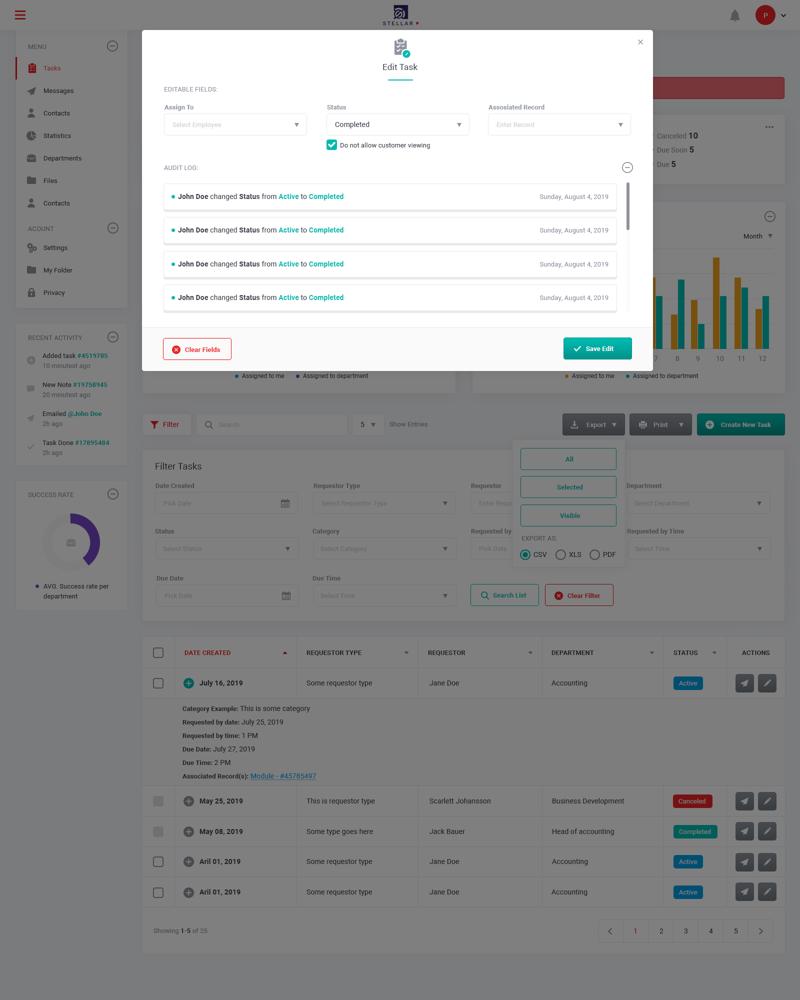

  
  <h1 style="text-align: center;">
    Stellar 2021 Test Project - Frontend Developer
  </h1>
  <h2 style="text-align: center; margin-top: 0px">
    Task Management - Edit Task
  </h2>

## Overview

Here are the following requirements for this takehome project.

**1. Project Summary**

Please provide me a summary of how you would implement the test project to:

- demonstrate your understanding of the requirements.

**2. Project Estimate**

**Please also provide an estimate (in number of hours)**

- broking down how you see fit to allocate the time you would anticipate requiring in order to complete each core aspect and,
- recognizing that unit tests are one such core aspect.

Remember, you do not need to actually complete the test project, just the aforementioned summary and estimates.

**3. Final Interview**

After I receive and review your summary and estimates, I will shoot you a Calendly link to schedule a final interview to review the information you put together.

## Table of Contents

- [Overview](#overview)
- [Table of Contents](#table-of-contents)
- [1. Purpose](#1-purpose)
- [2. Definitions](#2-definitions)
- [3. Project Summary](#3-project-summary)
  - [3.1 Business Needs](#31-business-needs)
  - [3.2 Objectives](#32-objectives)
  - [3.3 Scope](#33-scope)
    - [3.3.1 In Scope](#331-in-scope)
    - [3.3.2 Out of Scope](#332-out-of-scope)
  - [3.4 Workflow](#34-workflow)
  - [3.5 Project Approach](#35-project-approach)
  - [3.5.1 Project Methodology (PMM)](#351-project-methodology-pmm)
- [4. Project Management Estimates](#4-project-management-estimates)
    - [Purpose](#purpose)
    - [Scope management](#scope-management)
- [4.1 Initial High-Level Timeline](#41-initial-high-level-timeline)
  - [4.2 Cost - Benefit Analysis](#42-cost---benefit-analysis)
    - [4.2.1 Project Estimate Question Guide](#421-project-estimate-question-guide)
    - [Schedule and budget management](#schedule-and-budget-management)

## 1. Purpose

The purpose of this document is to provide an overview of the project. This includes the scope, objectives, high-level project approach and requirements, as well as benefits and a high-level cost estimate.

## 2. Definitions

The following additional terms and abbreviations are used in this document.

<table>
  <tr style="background-color: #009fE2; color: #fff;">
    <td>Term</td>
    <td>Definition</td>
  </tr>
  <tr>
    <td>BA</td>
    <td>Business Area</td>
  </tr>
    <tr>
    <td>CM</td>
    <td>Change management</td>
  </tr>
    <tr>
    <td>CR</td>
    <td>Change Request</td>
  </tr>
  <tr>
    <td>FDS</td>
    <td>Functional Design Specification</td>
  </tr>
  <tr>
    <td>PM</td>
    <td>Project Manager</td>
  </tr>
  <tr>
    <td>PMM</td>
    <td>Project Management Methodology</td>
  </tr>
  <tr>
    <td>SOPs</td>
    <td>Standard Operating Procedure</td>
  </tr>
  <tr>
    <td>WIs</td>
    <td>Work Instructions</td>
  </tr>
  <tr>
    <td>Rfi</td>
    <td>Request for Information</td>
  </tr>
  <tr>
    <td>RfP</td>
    <td>Request for Proposal</td>
  </tr>
  <tr>
    <td>TM</td>
    <td>Task Management</td>
  </tr>
  <tr>
    <td>TMM</td>
    <td>Task Management Module</td>
  </tr>
  <tr>
    <td>TMET</td>
    <td>Task Management Edit Task</td>
  </tr>
  <tr>
    <td>TMS</td>
    <td>Task Management Software</td>
  </tr>
</table>

---

## 3. Project Summary

The purpose of thie project is to provide a cost effective and user friendly TMS that allows the business to plan, track and manage their tasks efficiently and transparently.

There is an articulated need from the BAs for a TMET screen that forms part of a larger TMM. This "Edit Task" screen should provide a means to open the edit task screen for each task by way of an unformatted list of tasks.

### 3.1 Business Needs

The business has identified a series of needs that the TMET project must fulfill.

- Support proactive task management planning and global operations of Stellar IMS
- Imporve oversight of and maintain the knowledge from task management activities across business areas.
- Improve transparency of task creation, and relationship management via the following functional specifications:

  1. Audit Logs
  2. Editable Fields
  3. Requestor Fields
  4. Associated Record Fields
  5. Category Fields

### 3.2 Objectives

The objectives of the Stellar 2021 Test Project - Front End Developer project is to:

- **Plan.** Implement a standard Task Management - Edit Task (TMET) screen according to the technical requirements illustrating various functions defined in the functional specifications
- **Milestones.** Align the Task Management - Edit Task screen processes across all major phases in the software development lifecycle
- **Dependencies.** List all key dependencies/technical requirements and what their importance is to the project.
- **Resource Plan.** Provide a resource plan with a breakdown estimate of labor (in hours)

### 3.3 Scope

The scope section specifies the boundaries for the project both in terms of processes, functionality and user groups.

Changes to any of those areas will require a change request approved by the Steering Committee

#### 3.3.1 In Scope

**FUNCTIONAL SPECIFICATIONS**

**Epic:** I can use an Edit Tasks page to edit tasks and view an audit log that shows all previously made edits to tasks.
Stories:

<table>
<tr style="background-color: #009fE2; color: #fff;">
    <td>Function Spec Task</td>
    <td>Description</td>
  </tr>
  <tr>
    <td>1. Audit Log</td>
    <td>
      The audit log will display all changes that are made to a task using a <code>[Timestamp]</code> <code>[Who]</code> changed <code>[Field]</code> from <code>[Old Value]</code> to <code>[New Value]</code> format. 
      If no changes have been made the audit log will display a message stating, <em>“No changes have been made.”</em>
    </td>
  </tr>
  <tr>
    <td>2. Editable Fields</td>
    <td>
    Ability to make changes to all fields on a task including, but not limited to: 
    Creator, Requestor Type (defaults to Customer, dropdown also shows Internal), Requestor (see #3), Department, Status, Category (see #5), Requested By Date, Requested By Time, Due Date, Due Time, and Associated Record (see #4). 
    Use the attached “Add Task” and “Edit Task” visuals for the template of the edit screen and full list of fields and functions required. All task fields should be editable. Refer to the stories 3, 4, and 5 for information on the set up of the Requestor, Associated Record, and Category fields respectively.
    </td>
  </tr>
  <tr>
    <td>3. Requestor Field</td>
    <td>
    When editing the Requestor field, if the Requestor Type is set to Internal, they are presented with a list of all employees/back end users. 
      From the Requestor menu, I can search by any or all of the following fields: Customer ID, First Name, Last Name, Slip and/or Boat. When the user searches via one or more of these fields, they are presented with an autocomplete list of possible choices. 
    These choices will display one option per boat per customer record, and will display the Customer ID, First Name, Last Name, Slip, and Boat. If there is no boat associated with a customer record, the boat field will appear as N/A. Use the attached Add Task visuals to determine the layout of the requestor field as well as the set-up of the auto complete dropdown.
    </td>
  </tr>
  <tr>
    <td>4. Associated Record Field</td>
    <td>
    When editing the Associated Record field, they can select records from other modules that can be attached to the task they are currently editing. This will appear as an auto-complete drop down that provides them with options for records they can associate the task with.
    </td>
  </tr>
  <tr>
    <td>5. Category Field</td>
    <td>
      
When editing the Category field, a dropdown appears that lists all the Categories and any Categories with sub-categories (or categories that are of a lower hierarchy) can be found through an additional dropdown.

      
Within each sub-category, any sub-categories that have more sub-categories of a lower hierarchy can be accessed via more dropdowns, so on and so forth, until you reach a sub-category with no sub- categories of a lower hierarchy. Users can then select the Category from the dropdown at the lowest hierarchy or Other at any level the hierarchy.

      At the bottom of all dropdowns is an Other option that will be hard-coded and not presented as an option via JSON/the backend.
    </td>
  </tr>
</table>

#### 3.3.2 Out of Scope

- No header, footer or menu is required; simply the edit task screen itself.
- Effectively demonstrate your ability to match the visuals provided alongside all documented frontend functionality,
- Recognize that no backend, i.e. server-side development, is required for this test project.
- Remember that this test project is specifically the Edit screen, not the main screen, however a means to open the Edit screen for each task in an unformatted list of tasks is required.

### 3.4 Workflow

**This workflow is divided into five core processes:**

<iframe style="border: 1px solid rgba(0, 0, 0, 0.1);" width="800" height="450" src="https://www.figma.com/embed?embed_host=share&url=https%3A%2F%2Fwww.figma.com%2Ffile%2FEfWtY6F6vUvgmdcKFStgsn%2FWork-Breakdown-Structure-Stellar-FE%3Fnode-id%3D0%253A1" allowfullscreen></iframe>

1. Initiation:
   - Ideation and evaluation,
   - Project Charter
2. Planning:
   - Work Breakdown Structure (WBS)
   - Functional Specification Consulting
3. Build / Implementation / Execution
   - product design,
   - product development,
      1. Backend Development
      2. Frontend Web Development
      3. Mobile Application Development
      4. Infrastructure Management
   - product test
4. Control:
   - Project maintenance & Support
   - Process
   - Software
   - Team
5. Deploy / Closeout:
   - Audit

### 3.5 Project Approach

The implementation will start in February 2021 with a planned go-live for March 2021, followed by a 3 month iterative process that incorporates customer participation for the purpose of:

1. functionality prioritization,
2. getting user feedback ASAP, and
3. ensuring we build exactly what the client wants.

The project will follow the PMM System Route (agile)

### 3.5.1 Project Methodology (PMM)

**Process Scope**

**Stage 1: Backend Development**

Start from engineering the application backend. Stellar IMS web developers create the application and database architecture, business logic, and interfaces. To ensure code quality, our team lead and other developers on the team perform a code review.

- **No backend, frontend only**

**Backend Development Toolkit**

- Programming languages:
  - Node.js

- web application frameworks
  - Express.js

- Business logic framework:
  - Trailblazer

- Testing frameworks:
  - Jest
  - RSpec

- Data stores (RESTful and JSON objects/arrays)
  - static `.json` files only
  - All data should be dummy and self-explanatory of what the data represents,
    - view/edit a `name: “John Smith”`, or associated `record/ “Module 1 – Record 7"`,
    - view/edit an associated record as a link: `“/[module]/edit/[id]”`
  - **SCRUD (Search, Create, Read, Update, Delete) implementation**
    - **Record searches** via `GET/POST` (`POST` due to size limitations on `GET` requests)
    - **Record creation** via `POST`
    - **Record reads** via `GET`
    - **Record update** via `PUT`
    - **Record deletions** via `DELETE`
    - All auto-completes, searches, etc should make use use of the record search capability.

- Future API endpoints/backends
  - **TODO: API endpoints action plan to implement a real database**
  - PostgreSQL
  - MySQL
  - Redis
  - Memcached
  - MongoDB
  - Cassandra
  - Neo4j
  - ElasticSearch

**Stage 2: Frontend web development**

After the backend is ready, our frontend developers work in close cooperation with our UX designers to create the client side of the application. An emphasis on building a robust **Edit Task screen** user interface that is responsive, and mobile-friendly.

**Web frontend development toolkit**

- Programming Languages:
  - SASS
  - CSS3
  - JavaScript

- Frameworks and libraries
  - React.js
  - Redux
  - ContextAPI
  - Bootstrap 4
  - Reactstrap
  - Font Awesome
  - React-Bootstrap-Table2

- Testing Tools:
  - Jest
  - Enzyme

- REST Clients:
  - Axios
  - Fetch
  - Formik
  - Yup

- GraphQL Clients:
  - Apollo Client

**Stage 3: Mobile app development**

Our iOS and Android app developers create custom mobile applications for our clients who want to reach their customers on mobile devices. We use native technologies to build mobile apps and also provide cross-platform mobile application development with React Native.

**Mobile development toolkit**

- Programming languages
  - Swift
  - Objective-C
  - Kotlin
  - Java
  - JavaScript
  - Typescript

- Testing tools
  - Quick
  - Nimble
  - JUnit
  - RoboElectric
  - Espresso

- Libraries
  - React.js
  - Redux
  - ContextAPI

- Testing frameworks
  - Jest
  - Enzyme

- IDE
  - Xcode
  - Android Studio

**Stage 4: Infrastructure management**

At Stellar IMS, we configure a reliable, scalable, and secure cloud-based application infrastructure. Software configuration tools allow us to automate infrastructure management and reduce maintenance costs, while performance monitoring services notify our team about errors and crashes.

**DevOps toolkit**

- Cloud hosting platforms
  - AWS
  - Heroku

- Configuration management tools
  - Chef
  - Teraform

- Containerization tool
  - Docker

- Container orchestration system
  - Kubernetes

- Software monitoring services
  - NewRelic
  - Airbrake
  - Monit

- Continuous integration services
  - CircleCI
  - TravisCI

<!-- **Actuals in USD**
<table>
    <tr>
      <td>&nbsp;</td>
      <td>2021</td>
    </tr>
    <tr>
      <td>Phase</td>
      <td><b>Initiation / Business Analysis</b></td>
    </tr>
    <tr>
      <td>IT Internal</td>
      <td>1,200</td>
    </tr>
    <tr>
      <td>IT External (expected)</td>
      <td>N/a</td>
    </tr>
    <tr>
      <td>Total</td>
      <td>1,200</td>
    </tr>
</table>

---

<table>
    <tr>
      <td>&nbsp;</td>
      <td>2021</td>
    </tr>
    <tr>
      <td>Phase</td>
      <td><b>Planning / Design</b></td>
    </tr>
    <tr>
      <td>IT Internal</td>
      <td>2,500</td>
    </tr>
    <tr>
      <td>IT External (expected)</td>
      <td>N/a</td>
    </tr>
    <tr>
      <td>Total</td>
      <td>2,500</td>
    </tr>
</table>

---

<table>
    <tr>
      <td>&nbsp;</td>
      <td>2021</td>
    </tr>
    <tr>
      <td>Phase</td>
      <td><b>Build / Implemetation / Execute + QA</b></td>
    </tr>
    <tr>
      <td>IT Internal</td>
      <td>7,350</td>
    </tr>
    <tr>
      <td>IT External (expected)</td>
      <td>N/a</td>
    </tr>
    <tr>
      <td>Total</td>
      <td>7,350</td>
    </tr>
</table>

---

<table>
    <tr>
      <td>&nbsp;</td>
      <td>2021</td>
    </tr>
    <tr>
      <td>Phase</td>
      <td><b>Project Management</b></td>
    </tr>
    <tr>
      <td>IT Internal</td>
      <td>1,200</td>
    </tr>
    <tr>
      <td>IT External (expected)</td>
      <td>N/a</td>
    </tr>
    <tr>
      <td>Total</td>
      <td>1,200</td>
    </tr>
</table> -->

## 4. Project Management Estimates

Proper control and well-structured processes can prevent low-quality results, never-ending projects, going over budget, and late delivery.

#### Purpose

Project Management is responsible for the successful delivery of projects from the initiation stage through final delivery. Project management duties include the monitoring of each project on a daily basis and respond to all emerging issues.

#### Scope management

Our PMO refines, validates, and manages the scope of the project. The team defines all tasks and breaks down complex activities into smaller manageable ones.

> **What you get**
>
> **Work breakdown structure (WBS)**
>
> A work breakdown structure (WBS) provides a visual representation of all tasks and lays the foundation for time and money estimates.

## 4.1 Initial High-Level Timeline

The timetable for the project is shown in the following section

<iframe src='https://prod.teamgantt.com/gantt/schedule/?ids=2499670&public_keys=dtyO0jzdVhYS&zoom=d100&font_size=12&estimated_hours=1&assigned_resources=0&percent_complete=1&documents=0&comments=0&col_width=355&hide_header_tabs=1&menu_view=0&resource_filter=1&name_in_bar=1&name_next_to_bar=0&resource_names=1&resource_hours=1#user=&company=&custom=&date_filter=&hide_completed=false&color_filter=' style='width:100%; height:800px; border-bottom:1px #cbcbcb solid;' frameborder='0'></iframe>
<a href='http://teamgantt.com' target='_blank' style='display:block; text-align:right; background:url(https://prod.teamgantt.com/images/powered_by_teamgantt.png) right center no-repeat; height:0; padding-top:20px; overflow:hidden; padding-right:1px;'>Online Gantt Chart</a>

### 4.2 Cost - Benefit Analysis

The Cost-Benefit Analysis consists of the project cost and expenses until its go-live date, including some post-implementation expenses. In addition, the post-implementation savings and ongoing costs are juxtaposed.

Cost / benefit calculated with currency: <strong>$USD</strong> <input type="checkbox" checked="true" />

  <iframe frameBorder="0" src="https://prod.teamgantt.com/gantt/schedule/?ids=2499670&amp;public_keys=dtyO0jzdVhYS&amp;zoom=d100&amp;font_size=12&amp;col_width=255&amp;documents=0&amp;comments=0&amp;estimated_hours=1&amp;assigned_resources=1&amp;percent_complete=0&amp;hide_header_tabs=1&amp;menu_view=0&amp;resource_filter=0&amp;name_in_bar=1&amp;name_next_to_bar=0&amp;resource_names=1#" style="background:#eeeeee;border:1px #cbcbcb solid;margin:0 auto;width:100%;height:500px"></iframe><a href="http://teamgantt.com" style="display:block;text-align:right;background:url(https://prod.teamgantt.com/images/powered_by_teamgantt.png) right center no-repeat;height:0;padding-top:20px;overflow:hidden;padding-right:1px" target="_blank">Online Gantt Chart</a>

#### 4.2.1 Project Estimate Question Guide

Whether you’re estimating a project based on a formal request, a discussion, or an email from a stakeholder or manager, you need to know as
many project details as possible before you can provide a realistic estimate of time or cost.

#### Schedule and budget management

Our PMO facilitates the estimation process. Our project managers collect estimates from the development team and experts and measure risks. They develop and maintain schedule and cost management plans to keep the project within your budget and time limits.

> What you get
>
> **Work performance report**
> A work performance report describes updates on the progress of your project. This report shows where the project stands in terms of the planned schedule and budget.

<!--
#### Scope change management

Sometimes you need to change the priorities of tasks or respond to new business challenges by changing the scope. Our PMO checks change requests from our clients on a daily basis and prioritizes all current tasks in the project.

> **What you get:**
>
> **Change log**
> A change log records all changes made to the project and is updated regularly so you’re always aware of possible implications.

#### Communication and stakeholder management

Our PMO establishes effective communication to get everyone on the same page and achieve the project objectives. The PMO clarifies roles and responsibilities to prevent confusion and project delays.

> What you get

> **Communication management plan**
>
> A communication management plan describes all calls and meetings, specifying clearly the agenda, attendees, purpose, and duration of each.

#### Team management

The PMO defines the optimal team to complete the project within the approved schedule and budget. Every two weeks, the project management team reviews and corrects team performance to keep the project’s quality high throughout the project.

> What you get

> **Team progress report**
>
> A team progress report outlines tasks completed and milestones reached so that you know when particular functionality is ready.

#### Risk management

The Project Management Office constantly examines the project to identify all potential risks. They think through options and actions to eliminate those risks or reduce their negative effects on the project.

> What you get
>
> **RAID log (risks, assumptions, issues, dependencies)**
>
> A RAID log records all risks with their probabilities and potential impacts. The PMO keeps the RAID log up to date through weekly reviews.

### 5. System Delivery -->
